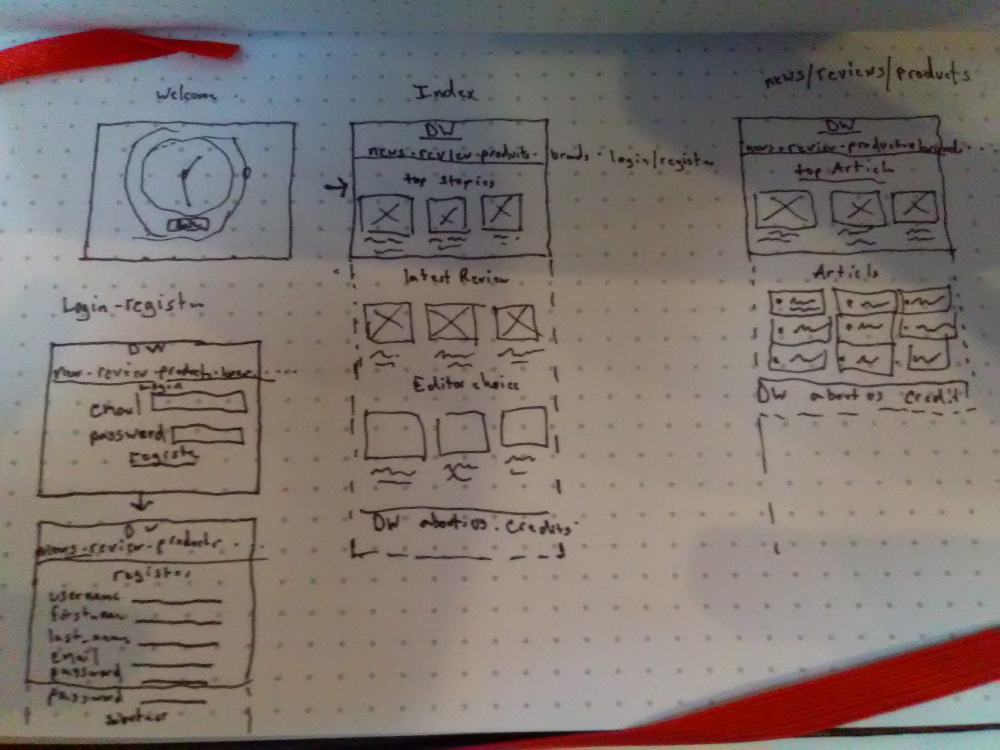

A readme that contains the following:
* Introduction to your app
    * A man’s dress watch news/review site

* site design reference
  * https://www.timex.com
  * https://www.tagheuer.com
  * https://www.tiffany.com/watches/mens-watches
  * https://www.chanel.com/us/watches
  * https://www.prestigetime.com

* Technologies to be used
    * react
    * ruby on rails
    * foreman
    * cors-rails
    * axios
    * postgrasql
    * html and css
    * react-router-dom
    * heroku

* Feature list (aka user stories)
    * user starts on the Welcome page with enter button which links to the home page
    * on the home page the user can find  the:
        * nav bar with links to : home, news, review, products, brands, login-register
        * a section of 3 to 4 news articles
        * a section of 3 to 4 review articles
        * a editor choice on the top products
        * a footer with links to: home, about page, credit page
    * on the news page the user can find the:
        * nav bar again
        * a section of 3 to 4 latest news articles
        * a section that list all news articles
        * a footer again
    * on the review page the user can find the:
        * nav bar again
        * a section of 3 to 4 latest review articles
        * a section that list all review articles
        * a footer again
    * on the products page the user can find the:
        * nav bar again
        * a section of 3 to 4 latest products articles
        * a section that list all products articles
        * a footer again
    * on the brand page the user can find the:
        * nav bar again
        * a section that list all brands
        * a footer again
            * selecting the brand name will show detail in on the brand
    * on the login-register page the user can find the:
        * nav bar again
        * a section that shows the form for login
        * a button to switch to the register page if user doesn’t have account setup
        * a footer again
            * if user switch to the register page
                * the section that shows the form will now show the register form
                * the button will switch back to the login page
    * on login the login-register will be replace by the profile page
        * on the profile page
            * nav bar again
            * a section that shows the from to edit profile info
            * a button to save profile info
            * a section that list all comments
            * a footer again
* ERD
    * User - has_many Comment , has_many Products
        * email
        * user_name
        * real_first_name
        * real_last_name
        * wishlist
            * Post MVP has_many replies
    * Comment - belong_to User, has_many Replies
        * title
        * text
        * commenter - fk
            * Post M.V.P - has_many replies
    * Reply - belong_to Comment - Post M.V.P
      * title
      * text
      * commenter_id
      * comment_id
    * Articles - belong_to User, has_many Comments
        * title
        * sub_title
        * text
        * author_id - fk
        * products_id - fk
    * products  - belong_to Brand has_many User
        * name
        * brand - fk
        * details
    * brands - has_many Products
        * name
        * website
        * logo
        * About
        * Head Quarters
        * founded
        * founder

* Wireframes

* M.V.P
    * user login/register
    * user can update profile
    * user can delete profile
    * user can edit comments
    * view user profile
    * user comment on articles
    * Auth
* Post M.V.P features
    * user has a wishlist
    * reply to comments
    * user block user
    * Admin can login
    * Admin can add/edit/delete articles
    * Admin can ban user
    * Admin can delete user comments
* Post Post M.V.P features
    * OAuth - google
    * welcome page shows real time on page
    * Add Editor tool to create and edit site for Admins
* Code example
* Installation instructions
